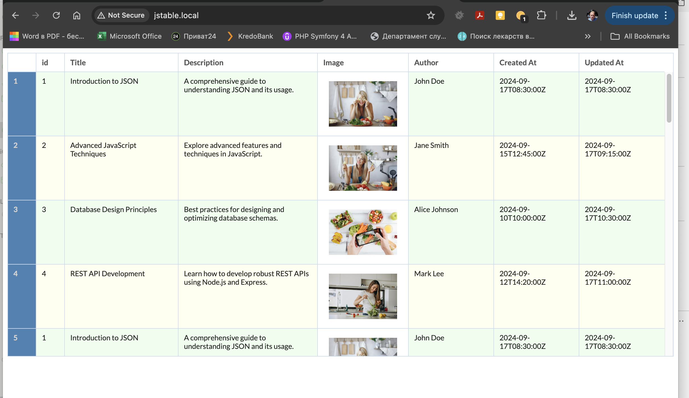

# js table

## url
https://jaisocx-tools.github.io/jstable/


## screenshot



## about
this sample web project is a sample of css styling of a database table records data in json format.

the html markup is produced by JSTable javascript class, used here in this project with javascript source code and no 3rd party dependencies.


### sorting columns feature
in this example, the click on column header sorts the table by column values.

in a real application, in the most cases, the table data is loaded by pages.

this sorting example is only arranging the subset of records 
of the one loaded page.

if Your table will use paginated loaded from server rows,
then instead of this sorting there must be just normal reload of rows from RestAPI URL with sorting parameters specified, if available.

```
jstable
  .setDataUrl('...?order-by=updated_at')
  .load();
```


## future improvements
I apologize, here is still no pagination bar. this will appear here later, hope so)).

## how to use

### how to set json data for the table
in the file www/index.html, on line 60,
there is the url to json file, containing table rows data in json format.
"/jstools/www/data/table.json"

You can set Your own url of any published in web json data of some table records.

### how to set columns in the table
in the file www/data/table-metadata.json there is the JSON file, having settings for table columns,

feel free to adjust number of columns and columns properties.

```
index.html, line 18:
      const tableHeader = {
        "id": {
          "title": "id",
          "type": "number",
          "width": "50px",
          "align": "right"
        },
        "image_src": {
          "title": "Image",
          "type": "image",
          ...
          ...
          ...

```

for more informations, how to specify columns widths, feel free to read css3 documentation 
about "grid layout". 


### styling
in file www/css/jstable.css from the top, there are css variables specified, 
those enable fast applying some basic look and feel customization. 


### urls, images sources, paths
in this project, the urls are relative, without domain name, 
however here was supposed, that the www folder is published as /jstable/www/ folder for the domain.

so, the {github project root}/www/index.html file is published like http://{domain}/jstable/www/index.html 

please, adjust urls in index.html and .css files to be accessible when You publish at Your domain.

